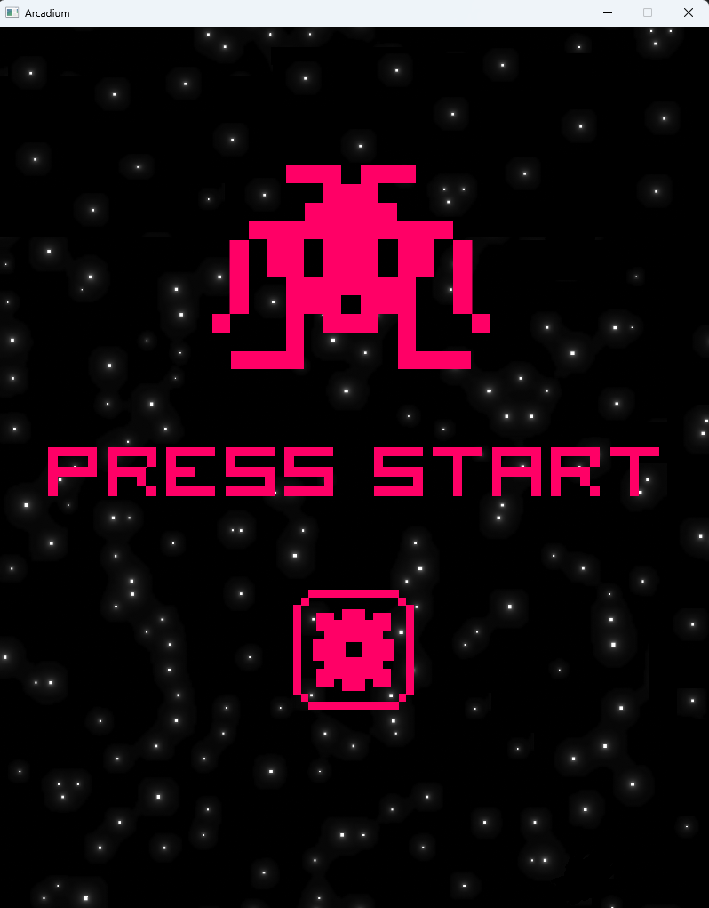
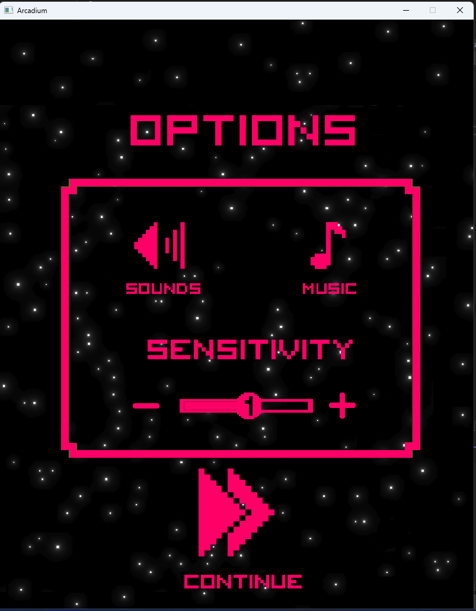
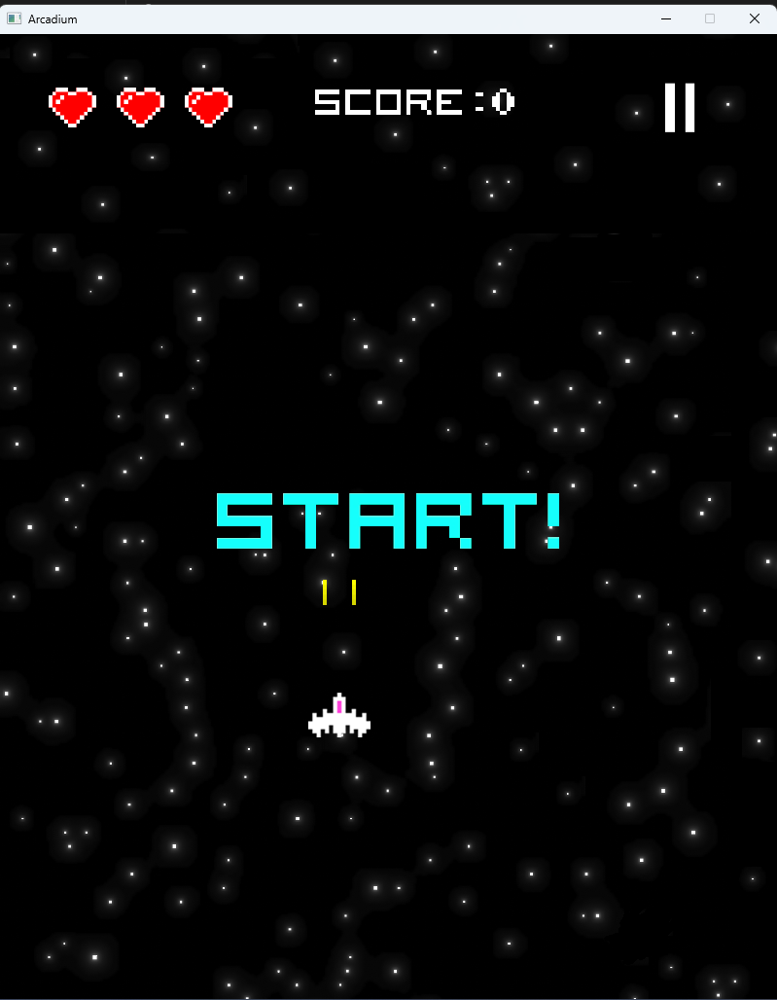
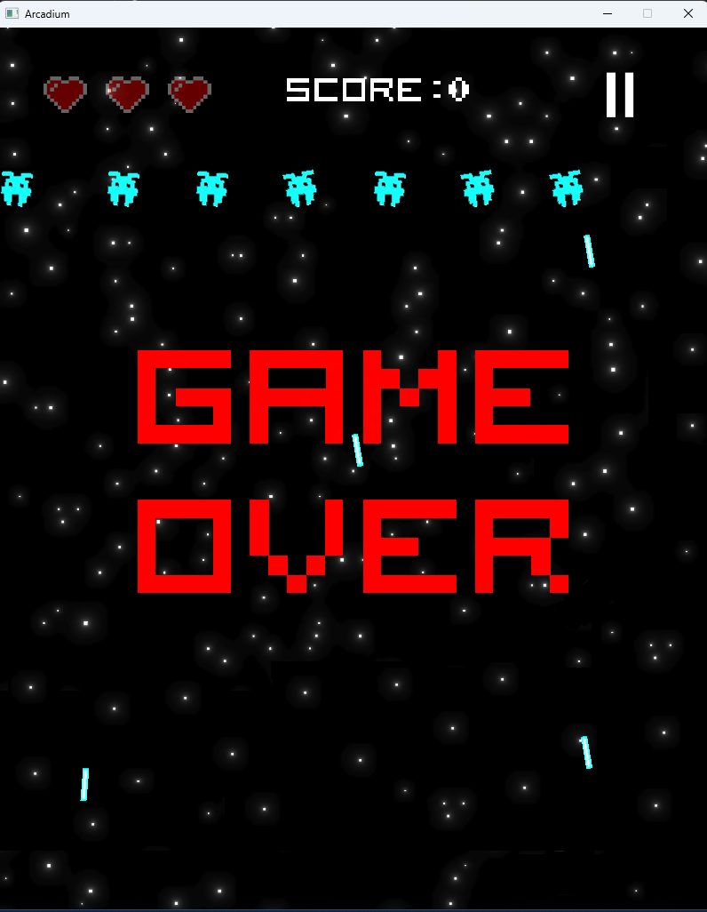
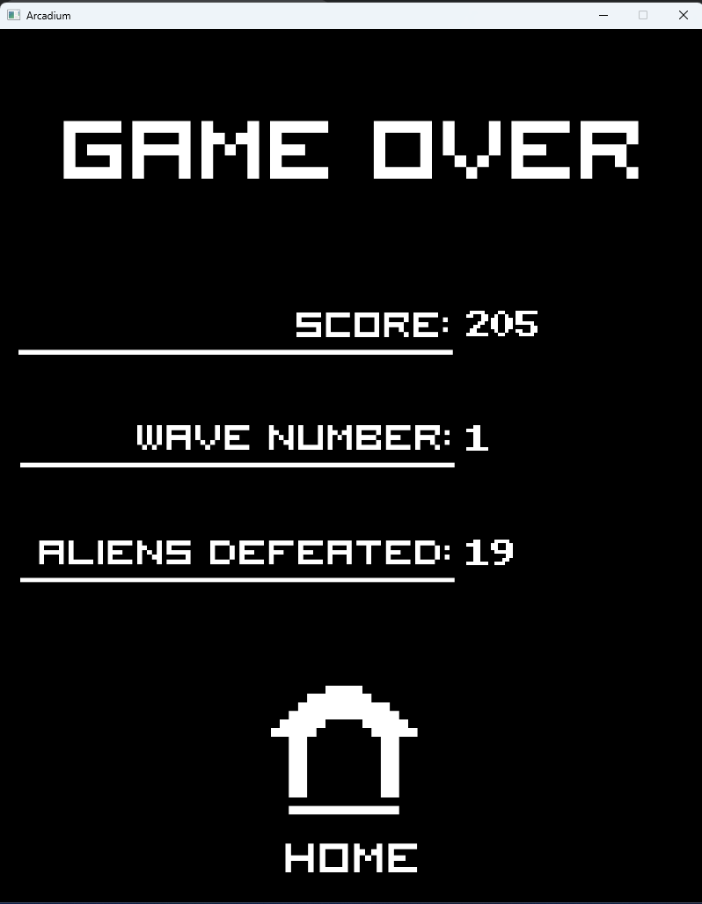

[[English]](README_en.md)

# Game Arcadium
- Demo game và giới thiệu chính về code game : https://drive.google.com/drive/folders/157-6H2uNI5fIchrmhjj2tJoZPPlyRuhU?usp=sharing

# Giới thiệu game

Arcadium là 1 game thuộc thể loại space shooter. Đắm mình vào cuộc chiến không gian chiến đấu với đội quân kẻ thì đông đảo, bạn phải tập trung và phản ứng nhanh nhẹn, di chuyển một cách thông minh để né sự tấn công của kẻ thù đồng thời tiêu diệu chúng. 
- [0. Cách tải game](#0-cách-tải-game)
- [1. Bắt đầu game](#1bắt-đầu-game)

- [2. Cách chơi game:](#2-cách-chơi-game)
- [3. Các thành phần trong game](#4-các-thành-phần-trong-game)
    * [a. Các giao diện tương tác trong game] (#acác-giao-diện-tương-tác-trong-game)
    * [b. Các loại địch] (#bcác-loại-địch)
    * [c. Các loại item và buff] (#ccác-loại-item-và-buff)
- [4. Chiến thắng và thất bại](#4-chiến-thắng-và-thất-bại)
- [Về source code game](#về-source-code-game)
- [Về tham khảo](#về-tham-khảo)
# 0. Cách tải game
- Các bạn tải file zip về rồi giải nén, chạy file .sln rồi chơi như bình thường (x64)
- Lưu ý màn hình cần độ phân giải FULL HD

# 1. Bắt đầu game

Chờ một chút thì màn hình sẽ hiện như sau.

Bạn có thể click vào hình răng cưa để chỉnh âm lượng, âm nhạc, độ nhạy di chuyển tàu vũ trụ.
  

Sau khi chỉnh xong bạn nhấn continue để quay lại màn hình chính. Bạn nhấn vào nới bất kì để bắt đầu chơi game hình Start hiện ra.

# 2. Cách chơi game

Bạn phải lần lượt vượt qua tổng cộng 6 wave thường và một wave boss đặc biệt để dành chiến thắng.
Cách di chuyển: bạn nhấn giữ chuột và di chuyển nó  để tàu vũ trụ của bạn có thể di chuyển theo với tỉ lệ độ nhạy, ví dụ bạn nhấn giữ và dịch chuyển chuột 10 (pixel) thì tàu bạn dịch chuyển được 10 * độ nhạy(pixel).
Với mức 0 bạn sẽ có độ nhạy là 0.7

với mức 1 bạn sẽ có độ nhạy là 1

với mức 2 bạn sẽ có độ nhạy là 1.3

# 3. Các thành phần trong game:
## a. Các giao diện tương tác trong game
-    Nút Pause 
     : là nút để dừng game khi bạn muốn tùy chỉnh hoặc muốn dừng lại để làm việc khác. Khi đó sẽ hiện ra màn hình Pause như sau.

     Nhấn continue để tiếp tục hoặc nhấn home để quay lại về màn hình chính, chú ý toàn bộ quá trình sẽ không được lưu lại.

-    Điểm số 
     : là nơi đếm số điểm mà bạn đang có

-    Máu của bạn 
     : là máu của bạn hiện có, nhiều nhất là 3 máu, và khi bị mất máu thì hình trái tim sẽ bị mờ dần đi.

## b. Các loại địch

Có 6 loại cây, lần lượt theo thứ tự có thể nhận được trong game là:

|                                                                             | Tên quái	 | Sức mạnh                                                                                                                   |
|-----------------------------------------------------------------------------|--------------|------------------------------------------------------------------------------------------------------------------------------|
|                         | Quái loại A	  | Mỗi lần bắn ra một viên đạn. (không định hướng)                                                                                             |
|                         | Quái loại B	   | Mỗi lần bắn ra ba viên đạn (không định hướng)                                                                                              |
|                         | Quái loại C	    | Nảy được trong tường (khung hình) và thi thoảng sẽ bắn ra đạn 4 phía                                                                   |
|                         | Quái loại D	    | Bắn ra đạn có thể đuổi người chơi |
|                         | Quái loại E   | Định hướng người chơi và bắn.
                                                                     |

## b. Các loại item và buff

- Có 5 loại zombie:

|                                         | Tên item 	       | Chức năng                                                                                        |
|-----------------------------------------|--------------------|--------------------------------------------------------------------------------------------------|
|  | Giáp	  | Giúp bạn có lá chắn bảo vệ bạn                                                                          |
|    | Chớp       | Giúp bạn giảm thởi gian load đạn                                                |
|    | Support	   | Bạn sẽ được hỗ trợ thêm bởi 2 support 2 bên                                                                    |
|  | bullet_x5	 |  Đạn của bạn sẽ bắn ra được 5 viên gần nhau                                                                |
|    | bullet_x7	       | Đạn của bạn sẽ bắn ra được 7 viên nhưng xa nhau |

# 5. Chiến thắng và thất bại

- Bạn sẽ chiến thắng nếu vượt qua được 6 màn và đánh thắng được boss cuối của game
bạn sẽ nhận được một lời chúc nếu chiến thắng (nên hãy cố gắng chiến thắng nhé)

- Bạn sẽ thất bại nếu không còn chút máu nào:

  
  và khi đó màn hình sẽ cho ra kết quả bạn đạt được:

---

### Về source code game:
- File Declaration:
    * Khai báo tất cả biến toàn cục.
- File Library: 
    * Chứa tất cả thư viện cần dùng.
- File SomeConst.h: 
    * Khai báo từng từng biến hằng 
    * Dùng để tiện chỉnh sửa vài thông số game.
- File SomeFunction.h: 
    * Một số Hàm dùng nhiều (như Rand, FindAngle)
- File LoadAll :
    * Dùng để load tất cả ảnh, phông chữ, nhạc trong game trước khi chơi.
- File RenewAll :
    * Dùng để load lại tất cả thông số trở về ban đầu.
- File Event: 
    * Xử lý các sự kiện trong game, sự kiện chuột trong từng trạng thái màn hình.
- File Event: 
    * Xử lý các wave quái.
- File RenderScreen.h: 
    * Dùng để Render những trạng thái màn hình khác nhau lên cửa sổ.
- Các file chứa Class của địch: 
    * Ennemies_A ,Ennemies_B ,Ennemies_C ,Ennemies_D ,Ennemies_E, Ennemies: là dùng để xử lí cho từng con quái một.
    * Boss : để dành cho Boss.
- Các file chứa Class của đạn, Boom: 
    * Bullet_Straight : Xử lí đạn thẳng.
    * Bullet_Triangle : Xử lí đạn tam giác.
    * Bullet_Triangle : Xử lí boom.
- Các file chứa Class khác:
    * Player : xử lý các thao tác, va chạm với người chơi;
    * Text : xử lí chữ trong game.
    * Item : xử lí item trong game.
### Về tham khảo:
- Tôi có tham khảo code của Lazy Foo' Và dùng chat GPT để tìm hiểu một số hàm.
